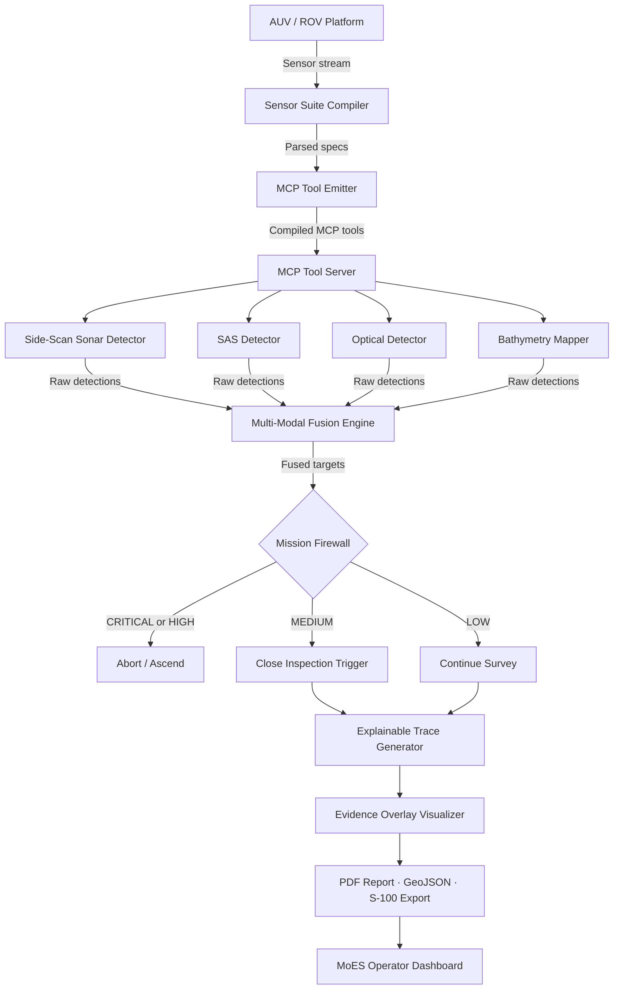
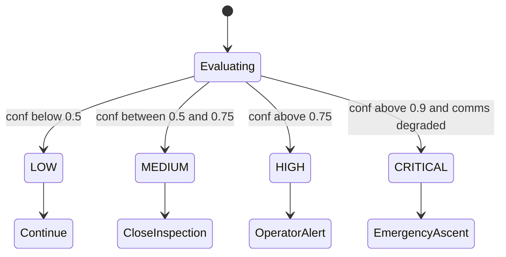

# 🌊 MarineGuard MCP

> **SIH Problem Statement SIH26057**
> **Ministry of Earth Sciences (MoES)**
> *AI-Powered Automated Underwater Marine Debris and Anomaly Detection System using Side-Scan Sonar Imagery*


---

## Overview

**MarineGuard MCP** is an autonomous **Model Context Protocol (MCP)** server that transforms any underwater survey vehicle (AUV / ROV) into a safe, explainable, real-time debris-detection agent. Built for SIH26057, it ingests multi-modal sensor streams (side-scan sonar, MBES bathymetry, 4K stereo optical, SAS, CTD) and produces legally auditable evidence packages for the Ministry of Earth Sciences.

---

## 🏗 System Architecture

```
┌──────────────────────────────────────────────────────────────────────┐
│                       MarineGuard MCP System                         │
├──────────────┬───────────────────┬────────────────┬──────────────────┤
│  Sensor Suite│   Detection &     │    Mission     │  Explainable     │
│  Compiler    │   Fusion Engine   │    Firewall    │  Trace Engine    │
│  (Module 1)  │   (Module 2)      │  (Module 3)    │  (Module 4)      │
├──────────────┴───────────────────┴────────────────┴──────────────────┤
│                     MCP Tool Server  (Module 5)                      │
├──────────────────────────────────────────────────────────────────────┤
│             Exporters: PDF · GeoJSON · S-100  (Module 6)             │
└──────────────────────────────────────────────────────────────────────┘
```

### Full Data Flow



---

## 🧩 Module Breakdown

### Module 1 — Sensor Suite Compiler
> `marineguard/compiler/`

Automatically parses AUV/ROV spec YAML files and emits live MCP tool stubs — no per-platform manual coding needed.

| File | Role |
|------|------|
| `sensor_parser.py` | Reads `sagar_netra.yaml`, `hugin_3000.yaml` |
| `geometry_solver.py` | Computes swath geometry, range, altitude from sensor physics |
| `pipeline_generator.py` | Generates ordered sensor pipeline config |
| `mcp_emitter.py` | Emits executable `@mcp.tool` stubs per detected sensor type |

---

### Module 2 — Detection & Fusion Engine
> `marineguard/detection/`

Multi-modal target detection with confidence-weighted sensor fusion.

| File | Sensor |
|------|--------|
| `side_scan.py` | 100/400 kHz side-scan sonar — shadow & highlight analysis |
| `sas.py` | Synthetic Aperture Sonar — sub-cm coherent imaging |
| `optical.py` | 4K stereo optical — YOLOv8-style bounding box detection |
| `bathymetry.py` | MBES — depth anomaly / protrusion detection |
| `fusion.py` | Dempster-Shafer evidence fusion across all sensors |

---

### Module 3 — Mission Firewall
> `marineguard/firewall/`

Formal risk taxonomy enforcement before **any** vehicle action is executed.

| Risk Level | Trigger | Action |
|-----------|---------|--------|
| `LOW` | conf < 0.5, battery > 40% | Log & continue |
| `MEDIUM` | conf 0.5–0.75 | Trigger close inspection |
| `HIGH` | conf > 0.75 OR battery < 20% | Alert operator |
| `CRITICAL` | conf > 0.9 AND comms degraded | Emergency ascent |



---

### Module 4 — Explainable Trace Engine
> `marineguard/trace/`

Generates step-by-step reasoning logs + multi-modal visual evidence overlays.

| File | Output |
|------|--------|
| `tracer.py` | Structured JSON decision log per target |
| `evidence_overlay.py` | Sonar waterfall + optical crop + SAM2 mask + bathymetry cross-section composite |
| `visualizer.py` | matplotlib-based visual report pages |

---

### Module 5 — MCP Tool Server
> `marineguard/mcp_server.py`

The central MCP server exposing all compiled tools to any MCP-compatible LLM agent.

| Tool | Description |
|------|-------------|
| `marine_debris_survey` | Full autonomous mission orchestration |
| `start_side_scan_survey` | Start SSS acquisition |
| `detect_debris_sonar` | Run sonar detection pipeline |
| `start_sas_survey` | SAS coherent imaging (Kongsberg HUGIN 3000) |
| `detect_debris_optical` | Optical YOLOv8 detection pass |
| `start_bathymetry_mapping` | MBES depth mapping |
| `classify_target` | Fuse all sensor results → final classification |
| `trigger_close_inspection` | Approach & re-image target |
| `export_report` | Generate PDF / GeoJSON / S-100 package |

---

### Module 6 — Exporters
> `marineguard/exporters/`

Standards-compliant output generation for official MoES submission.

| File | Format |
|------|--------|
| `pdf_report.py` | ReportLab PDF — mission summary, evidence plates, risk table |
| `geojson_export.py` | GeoJSON FeatureCollection of all targets |
| `s100_export.py` | IHO S-100 compliant XML for hydrographic charts |

---

## 📁 Repository Structure

```
marineguard-mcp/
├── README.md
├── requirements.txt
├── config.yaml
├── .gitignore
│
├── marineguard/
│   ├── __init__.py
│   ├── schemas.py                     # Pydantic V2 shared data contracts
│   ├── mcp_server.py                  # MCP Tool Server (Module 5)
│   ├── compiler/
│   │   ├── sensor_parser.py
│   │   ├── geometry_solver.py
│   │   ├── pipeline_generator.py
│   │   └── mcp_emitter.py
│   ├── detection/
│   │   ├── side_scan.py
│   │   ├── sas.py
│   │   ├── optical.py
│   │   ├── bathymetry.py
│   │   └── fusion.py
│   ├── firewall/
│   │   ├── risk_taxonomy.py
│   │   ├── policy.py
│   │   └── operator_ui.py
│   ├── trace/
│   │   ├── tracer.py
│   │   ├── evidence_overlay.py
│   │   └── visualizer.py
│   └── exporters/
│       ├── pdf_report.py
│       ├── geojson_export.py
│       └── s100_export.py
│
├── data/
│   ├── sensor_specs/
│   ├── test_data/
│   ├── evidence/                      # (gitignored)
│   └── reports/                       # (gitignored)
│
├── tests/
│   ├── test_compiler.py
│   ├── test_detection.py
│   ├── test_firewall.py
│   └── test_trace.py
│
├── demo.py
├── streamlit_demo.py
└── eval.py
```

---

## 🚀 Quick Start

### 1. Clone & Install
```bash
git clone https://github.com/ayushbudake-ai/marineguard-mcp.git
cd marineguard-mcp
pip install -r requirements.txt
```

### 2. Run Pytest Suite
```bash
pytest tests/ -v
```

### 3. Interactive CLI Demo
```bash
python demo.py --simulate
```

### 4. Streamlit Web Command Center
```bash
streamlit run streamlit_demo.py
```

### 5. Evaluation Benchmark
```bash
python eval.py
```

---

## 📊 Supported Platforms

| Platform | Sensors | MCP Tools Compiled |
|----------|---------|-------------------|
| Sagar Netra (AUV-01) | SSS 100/400kHz, MBES, Optical, CTD | 9 |
| Kongsberg HUGIN 3000 | SAS, MBES, Optical, ADCP | 9 |

---

## 📄 License & Attribution

Designed for **Ministry of Earth Sciences (MoES) SIH26057** hackathon.
Stand-in platform **Sagar Netra (AUV-01)** is used for demonstration purposes.

© 2024 MarineGuard Team | MIT License
