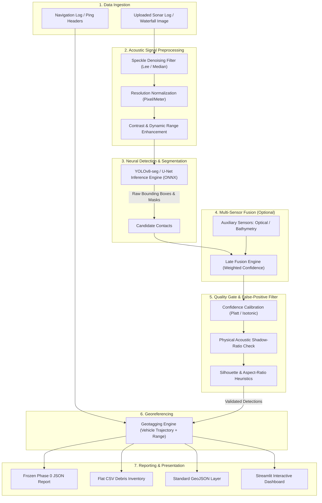
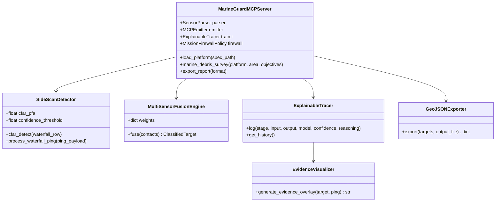

# MarineGuard: Automated Underwater Marine Debris Detection System:
## Comprehensive Technical & Architectural Documentation:

**Repository:** `ayushbudake-ai/marineguard-mcp`  
**Problem Statement ID:** SIH26057  
**Nodal Ministry:** Ministry of Earth Sciences (MoES), Government of India  
**System Classification:** Acoustic Computer Vision & Survey Analytics Pipeline  

---

## Table of Contents
1. [Project Overview](#1-project-overview)
2. [Problem Statement & Purpose](#2-problem-statement--purpose)
3. [Features (Current vs. Planned)](#3-features-current-vs-planned)
4. [System Architecture](#4-system-architecture)
5. [Technology Stack & Dependencies](#5-technology-stack--dependencies)
6. [Repository Structure](#6-repository-structure)
7. [Core Components & Modules Inventory](#7-core-components--modules-inventory)
8. [Application Workflow & Data Pipelines](#8-application-workflow--data-pipelines)
9. [API Documentation & Tool Interfaces](#9-api-documentation--tool-interfaces)
10. [Data Models & Frozen Report Schemas](#10-data-models--frozen-report-schemas)
11. [Authentication, Safety & Security](#11-authentication-safety--security)
12. [Configuration & Environment Variables](#12-configuration--environment-variables)
13. [Installation & Setup Guide](#13-installation--setup-guide)
14. [Running the Project](#14-running-the-project)
15. [Testing & Quality Assurance](#15-testing--quality-assurance)
16. [Edge Deployment Considerations](#16-edge-deployment-considerations)
17. [Known Limitations & Prototype Constraints](#17-known-limitations--prototype-constraints)
18. [Current Implementation Status & Discrepancy Matrix](#18-current-implementation-status--discrepancy-matrix)
19. [Future Improvements & Roadmap](#19-future-improvements--roadmap)

---

## 1. Project Overview

**MarineGuard** is an automated underwater marine debris and anomaly detection system engineered to process Side-Scan Sonar (SSS) acoustic imagery and auxiliary sensor streams. Designed for maritime agencies and marine research institutions under the Ministry of Earth Sciences (MoES), MarineGuard converts raw acoustic waterfall data into actionable, georeferenced anomaly reports.

The project originated as an experimental Model Context Protocol (MCP) tool server exploring multi-modal fusion and autonomous vehicle mission safety ("MarineGuard MCP"). Following architectural evaluation against the official SIH26057 problem statement, the system underwent a disciplined scope correction: realigning focus directly on high-throughput acoustic preprocessing, deep learning-based debris segmentation, statistical confidence calibration, false-positive suppression, and standardized GIS/tabular reporting.

---

## 2. Problem Statement & Purpose

### 2.1 The Environmental Crisis
Anthropogenic marine debris — specifically abandoned, lost, or discarded fishing gear (ALDFG), collectively known as **"ghost nets"**, along with industrial plastics, submerged metallic drums, and discarded cables — poses catastrophic risks to oceanic ecosystems:
* **Passive Wildlife Mortality:** Ghost nets drift or snag on reefs, continuously entangling fish, sea turtles, marine mammals, and crustaceans.
* **Habitat Destruction:** Heavy nets and steel cables abrade and smother sensitive coral reefs and benthic flora.
* **Maritime Navigation Hazards:** Submerged ropes and debris foul commercial vessel propellers and damage underwater cables and pipelines.

### 2.2 The Acoustic Survey Challenge
Acoustic survey methods such as Side-Scan Sonar (SSS) towed by vessels or mounted on Autonomous Underwater Vehicles (AUVs) are the gold standard for wide-swath seafloor mapping in turbid or deep waters where optical cameras are blinded. However:
1. **Data Volume:** Survey missions produce hundreds of gigabytes of acoustic waterfall records representing thousands of line-kilometers of seafloor.
2. **Human Fatigue:** Manual post-survey review by hydrographic analysts is slow, expensive, and subject to severe cognitive fatigue.
3. **Acoustic Camouflage:** Flexible ghost nets drape over complex bathymetric terrain, mimicking sand ripples, rock clusters, and natural shadows.

### 2.3 System Purpose
MarineGuard automates this detection pipeline, applying computer vision and signal processing directly to acoustic waterfall imagery to rapidly flag, classify, locate, and export debris targets with quantifiable statistical confidence.

---

## 3. Features (Current vs. Planned)

To maintain absolute transparency in line with engineering honesty rules, system capabilities are explicitly demarcated into **Implemented**, **Partially Implemented / Mocked**, and **Planned**:

| Feature Area | Implemented (Verified in Codebase) | Partially Implemented / Mocked | Planned (Phase 1–3 Roadmap) |
|:---|:---|:---|:---|
| **Acoustic Preprocessing** | Basic line-by-line array slicing in `side_scan.py` | Heuristic CFAR noise thresholding | Enhanced Lee/Median speckle filter, bilinear resolution normalization, shadow-aware augmentations |
| **Object Detection & Segmentation** | 1D Cell-Averaging Constant False Alarm Rate (CA-CFAR) anomaly detector | Mock contact extraction from synthetic ping streams | YOLOv8-seg / U-Net instance segmentation exported to ONNX runtime |
| **Multi-Sensor Fusion** | Confidence-weighted late fusion engine (`fusion.py`) supporting Sonar, Optical, Bathymetry | Multi-sensor confidence boost (+0.05 bonus) | Deep multi-modal feature fusion on paired sensor logs |
| **False-Positive Filtering** | Basic threshold gating (`confidence_threshold = 0.50`) | Contact metadata checks | Physical acoustic shadow-ratio validation ($L_s \propto H_t \cdot R / H_a$) and silhouette aspect-ratio filter |
| **Geotagging & Positioning** | Data schema fields for latitude and longitude | Static mock coordinates assigned in test harness (`13.0835, 80.2715`) | Automatic ping-header navigation parser translating vehicle position, heading, and across-track range |
| **Reporting & Export** | GeoJSON GIS FeatureCollection (`geojson_export.py`), ReportLab PDF (`pdf_report.py`), S-100 JSON (`s100_export.py`) | Export flow driven by synthetic `ClassifiedTarget` objects | Dedicated `json_csv_report.py` conforming strictly to the frozen Phase 0 schema |
| **User Interface** | Streamlit Command Center (`streamlit_demo.py`) with Plotly GIS map, trace viewer, firewall tab, and export center | Synthetic survey trigger button | Streamlit 4-tab upload-driven workflow: Upload $\to$ Overlay $\to$ Map $\to$ Metrics $\to$ Download |
| **Explainable Traces** | `ExplainableTracer` and `EvidenceVisualizer` generating multi-panel composite evidence images | Synthetic highlight/shadow crops | Automated evidence montage linking raw sonar patches with filter audit strings |
| **Sensor Compiler** | `marineguard/compiler/` parsing YAML specs (`sagar_netra.yaml`, `hugin_3000.yaml`) into tools | Static rule-based tool emission | Frozen secondary asset demonstrating multi-vehicle extensibility |

---

## 4. System Architecture

MarineGuard adopts a decoupled pipeline architecture designed to process sonar imagery independently of hardware actuation.

### 4.1 High-Level Data Flow



### 4.2 Module Inter-Relationships



---

## 5. Technology Stack & Dependencies

### 5.1 Programming Language & Core Runtime
* **Python 3.10 / 3.11 / 3.12:** Primary implementation language.
* **ONNX Runtime (Planned Core):** Edge-optimized inference engine supporting CPU, CUDA, and TensorRT execution providers.

### 5.2 Python Dependencies (`requirements.txt`)
* `pydantic>=2.0.0`: Strict schema modeling and data validation.
* `pyyaml>=6.0`: Platform specification parsing (`sagar_netra.yaml`).
* `numpy>=1.24.0`: Array manipulation for acoustic waterfall slices and matrix operations.
* `pillow>=9.0.0`: Image processing and synthetic patch composition.
* `matplotlib>=3.5.0`: Evidence overlay visualizer and diagnostic plotting.
* `rich>=13.0.0`: Formatted terminal output for CLI demo and benchmark suites.
* `streamlit>=1.25.0`: Web command center and review interface.
* `reportlab>=3.6.0`: Programmatic PDF survey report compilation.
* `pytest>=7.0.0`: Automated unit and integration testing suite.

---

## 6. Repository Structure

```
marineguard-mcp/
├── .gitignore                          # Git ignore rules
├── config.yaml                         # Global configuration parameters
├── demo.py                             # Interactive CLI terminal demonstration
├── eval.py                             # Evaluation benchmark runner
├── README.md                           # Project landing documentation
├── requirements.txt                    # Python package dependencies
├── streamlit_demo.py                   # Streamlit web command center
├── COMPLETE_MARINEGUARD_CODEBASE.py   # [Flagged for removal] Obsolete text manifest
│
├── .streamlit/
│   └── config.toml                     # Streamlit server and theme configuration
│
├── data/
│   ├── sensor_specs/                   # Platform specification YAML files
│   │   ├── sagar_netra.yaml            # MoES Sagar Netra AUV-01 sensor package
│   │   └── hugin_3000.yaml             # Kongsberg HUGIN 3000 spec
│   ├── splits/                         # Dataset split definitions (train/val/test)
│   └── test_data/
│       └── sample_frames.py            # FrameReplayHarness generating synthetic pings
│
├── docs/                               # Project technical documentation
│   ├── architecture.md                 # High-level data flow & module inventory
│   ├── demo.html                       # Standalone static web demonstration
│   ├── design.md                       # Engineering design & frozen schema
│   ├── index.html                      # GitHub Pages project landing page
│   ├── memory.md                       # Decision log & scope correction history
│   ├── phases.md                       # Hackathon execution roadmap & exit criteria
│   ├── project_requirement_document.md # Formal PRD aligned with SIH26057
│   ├── PROJECT_DOCUMENTATION.md        # Master technical specification (this document)
│   └── rules.md                        # 9 engineering rules & honesty guidelines
│
├── marineguard/                        # Core Python package
│   ├── __init__.py                     # Package entry point
│   ├── mcp_server.py                   # MCP server and survey orchestrator
│   ├── schemas.py                      # Pydantic V2 data contracts
│   │
│   ├── compiler/                       # Module 1: Sensor Suite Compiler (Frozen)
│   │   ├── geometry_solver.py          # Swath and altitude geometric solver
│   │   ├── mcp_emitter.py              # Dynamic MCP tool registration
│   │   ├── pipeline_generator.py       # Ordered pipeline generator
│   │   └── sensor_parser.py            # YAML spec parser
│   │
│   ├── detection/                      # Module 2: Detection & Fusion Engines
│   │   ├── bathymetry.py               # Bathymetric anomaly detector (Mock)
│   │   ├── fusion.py                   # Multi-sensor late fusion engine
│   │   ├── optical.py                  # Optical frame detector (Mock)
│   │   ├── sas.py                      # Synthetic Aperture Sonar detector (Mock)
│   │   └── side_scan.py                # 1D CA-CFAR side-scan waterfall detector
│   │
│   ├── exporters/                      # Module 3: Report Exporters
│   │   ├── geojson_export.py           # GeoJSON FeatureCollection exporter
│   │   ├── pdf_report.py               # ReportLab MoES PDF survey exporter
│   │   └── s100_export.py              # [Out of Scope] IHO S-100 catalogue exporter
│   │
│   ├── firewall/                       # [Out of Scope] Mission Safety Firewall
│   │   ├── operator_ui.py              # Terminal intercept UI formatter
│   │   ├── policy.py                   # Dynamic risk policy engine
│   │   └── risk_taxonomy.py            # Vehicle action risk classification
│   │
│   └── trace/                          # Module 4: Explainable Trace Engine
│       ├── evidence_overlay.py         # Multi-panel composite generator
│       ├── tracer.py                   # Event trace auditor
│       └── visualizer.py               # Matplotlib visual evidence renderer
│
└── tests/                              # Automated Pytest Suite
    ├── test_compiler.py                # Sensor parser & compiler tests (4 passed)
    ├── test_detection.py               # Side-scan & fusion tests (1 passed)
    ├── test_firewall.py                # Firewall policy tests (2 passed)
    └── test_trace.py                   # Tracer & audit tests (2 passed)
```

---

## 7. Core Components & Modules Inventory

### 7.1 `marineguard.schemas`
Central repository of Pydantic V2 models defining domain entities:
* `PlatformSpec`, `SensorSpec`, `PlatformComms`: Hardware definitions.
* `DebrisContact`: Single-sensor acoustic contact with bounding box, raw confidence, and shadow ratio.
* `ClassifiedTarget`: Fused and filtered marine debris contact with species tag, calibrated confidence, dimensions, coordinates, and removal priority.
* `TraceEvent`: Structured audit record logging pipeline reasoning at each processing stage.
* `SurveyJob`: High-level survey execution metadata.

### 7.2 `marineguard.detection`
* `SideScanDetector` (`side_scan.py`): Implements Cell-Averaging Constant False Alarm Rate (`CA-CFAR`) to identify acoustic highlights against localized noise floors:
  $$\alpha = N \cdot (P_{\text{fa}}^{-1/N} - 1), \quad T = \alpha \cdot \mu_{\text{noise}}$$
  Extracts candidate contacts if raw confidence exceeds `confidence_threshold` ($0.50$).
* `MultiSensorFusionEngine` (`fusion.py`): Combines multi-modal detections using confidence-weighted late fusion:
  $$\text{Score}_{\text{fused}} = \frac{\sum w_i \cdot c_i}{\sum w_i} + \Delta_{\text{multi-sensor}}$$
  Default weights: Sonar ($0.40$), SAS ($0.50$), Optical ($0.35$), Bathymetry ($0.25$). Adds a $+0.05$ confidence bonus when $\ge 2$ distinct sensors confirm the contact.

### 7.3 `marineguard.trace`
* `ExplainableTracer` (`tracer.py`): Maintains an in-memory chronological journal of all pipeline inferences, recording input summaries, output classifications, model identifiers, and natural-language reasoning.
* `EvidenceVisualizer` (`visualizer.py`): Generates 4-panel diagnostic composite images:
  1. Side-scan sonar waterfall crop with highlight and acoustic shadow contours.
  2. Acoustic signal intensity profile.
  3. Optical verification crop.
  4. Bathymetric anomaly depth grid.

### 7.4 `marineguard.compiler` (Kept Frozen)
Parses AUV platform spec sheets (e.g. `sagar_netra.yaml`) into strongly-typed `PlatformSpec` models, calculates acoustic swath geometry, and automatically binds sensor feeds to processing pipelines.

### 7.5 `marineguard.exporters`
* `GeoJSONExporter` (`geojson_export.py`): Serializes classified contacts into standard OGC GeoJSON `FeatureCollection` (EPSG:4326) with rich property dictionaries for QGIS / ArcGIS.
* `PDFReportExporter` (`pdf_report.py`): Generates publication-grade PDF survey summary reports using ReportLab.
* `S100Exporter` (`s100_export.py`): Serializes hydrographic features into IHO S-100 compliant JSON catalogues (designated out-of-scope for core SIH26057 evaluation).

---

## 8. Application Workflow & Data Pipelines

### 8.1 Operational Pipeline (Production Target)
1. **Upload:** Analyst uploads raw side-scan sonar image or XTF/GSF log file via the dashboard.
2. **Preprocessing:** The raw acoustic stream is filtered for speckle noise, normalized to standard meters-per-pixel resolution, and dynamic range adjusted.
3. **Inference:** A YOLOv8-seg ONNX model executes forward inference, generating class IDs, masks, and bounding boxes.
4. **Filtering:** Detections are evaluated by the acoustic shadow-ratio and aspect-ratio filters; non-compliant contacts are flagged or rejected.
5. **Georeferencing:** Target positions are translated from sensor across-track distance to real-world WGS-84 coordinates using navigation ping headers.
6. **Reporting:** A frozen Phase 0 JSON document and companion CSV file are written to disk and made available for immediate download.

### 8.2 Replay Demonstration Workflow (Current Repository Implementation)
In the current repository prototype:
1. `FrameReplayHarness` (`sample_frames.py`) generates synthetic side-scan waterfall matrices ($256 \times 256$), optical crops ($128 \times 128 \times 3$), and bathymetric grids ($32 \times 32$) corresponding to 4 pre-configured target profiles (`Contact_01` through `Contact_04`).
2. `MarineGuardMCPServer.marine_debris_survey()` ingests 4 synthetic pings in a loop, invoking `SideScanDetector`, `OpticalDetector`, and `BathymetryDetector`.
3. Contacts are aggregated and passed to `MultiSensorFusionEngine.fuse()`, which assigns fused confidence, removal priority, and entanglement risk.
4. `ExplainableTracer` logs the multi-sensor fusion stage.
5. Results are surfaced in `streamlit_demo.py` across an interactive Map, Trace Inspector, Firewall Intercept view, and Export Center.

---

## 9. API Documentation & Tool Interfaces

While the natural-language MCP interface is de-scoped from SIH26057 evaluation, the programmatic Python APIs remain clean and modular:

### 9.1 Survey Execution API
```python
from marineguard.mcp_server import MarineGuardMCPServer

# Initialize server with platform specification
server = MarineGuardMCPServer("data/sensor_specs/sagar_netra.yaml")

# Execute survey across designated geographic polygon
result = server.marine_debris_survey(
    platform="Sagar Netra",
    survey_area={"type": "Polygon", "coordinates": [...]},
    objectives=["ghost_nets", "plastics", "metal"]
)

# Output structure
# result = {
#     "status": "COMPLETED",
#     "platform": "Sagar Netra",
#     "survey_area_km2": 2.30,
#     "contacts_detected": 16,
#     "targets_classified": 4,
#     "classified_targets": [...]
# }
```

### 9.2 Export API
```python
# Export to standardized formats
geojson_package = server.export_report("GeoJSON")
pdf_package = server.export_report("PDF")

print(f"GeoJSON exported to: {geojson_package['file_path']}")
print(f"PDF Report exported to: {pdf_package['file_path']}")
```

---

## 10. Data Models & Frozen Report Schemas

### 10.1 Frozen Phase 0 Standard Report Schema (`design.md §1`)
All exporters and pipeline consumers must adhere strictly to this schema:

```json
{
  "$schema": "http://json-schema.org/draft-07/schema#",
  "title": "MarineGuardSurveyReport",
  "type": "object",
  "required": ["survey_id", "source_log", "generated_at", "detections", "summary"],
  "properties": {
    "survey_id": { "type": "string", "example": "SRV_20260904_001" },
    "source_log": { "type": "string", "example": "survey_track_042.xtf" },
    "generated_at": { "type": "string", "format": "date-time" },
    "detections": {
      "type": "array",
      "items": {
        "type": "object",
        "required": ["detection_id", "classification", "confidence", "bounding_box", "location", "depth_m", "sensor_source"],
        "properties": {
          "detection_id": { "type": "string" },
          "classification": {
            "type": "string",
            "enum": ["ghost_net", "plastic", "metal", "shipwreck", "pipe", "unknown"]
          },
          "confidence": { "type": "number", "minimum": 0.0, "maximum": 1.0 },
          "bounding_box": {
            "type": "object",
            "required": ["width_m", "height_m"],
            "properties": {
              "width_m": { "type": "number" },
              "height_m": { "type": "number" }
            }
          },
          "location": {
            "type": "object",
            "required": ["lat", "lon"],
            "properties": {
              "lat": { "type": "number" },
              "lon": { "type": "number" }
            }
          },
          "depth_m": { "type": "number" },
          "sensor_source": {
            "type": "string",
            "enum": ["side_scan", "optical", "bathymetry", "fused"]
          }
        }
      }
    },
    "summary": {
      "type": "object",
      "required": ["total_detections", "high_confidence_count"],
      "properties": {
        "total_detections": { "type": "integer" },
        "high_confidence_count": { "type": "integer" }
      }
    }
  }
}
```

---

## 11. Authentication, Safety & Security

### 11.1 Mission Safety Firewall Status
The repository contains a fully functional Mission Safety Firewall (`marineguard/firewall/`), implementing policy checks based on `ICAR-2024`:
* Minimum battery reserve threshold: $25\%$
* Minimum acoustic communications link: $5.0\text{ kbps}$
* Action risk taxonomy: `LOW`, `MEDIUM`, `HIGH`, `CRITICAL`

**Scope Disposition:** Because the SIH26057 challenge evaluates computer vision detection and survey reporting rather than autonomous vehicle navigation or actuation, the Mission Firewall is **de-scoped from the critical competition evaluation path**. It is preserved in the repository as an auxiliary capability demonstrating fail-safe architectural thinking, but is excluded from core deliverable scoring.

### 11.2 Data Integrity & Security
* **Offline Operation:** Zero reliance on remote APIs or cloud inference services; fully air-gapped survey vessels cannot leak sensitive hydrographic data.
* **Auditability:** Every classified contact carries an immutable `evidence_id` tracing directly to raw sonar pings and model reasoning logs.

---

## 12. Configuration & Environment Variables

System configuration is managed through `config.yaml`:

```yaml
compiler:
  supported_formats:
    sonar: [XTF, GSF, SAS, SDF]
    bathymetry: [GSF, HDF5, BAG]
    optical: [GenICam, ROS Image, MP4]
    navigation: [ROS NavSatFix, USBL UDP, NMEA]
  models:
    side_scan: "models/yolo8_seg_sonar.onnx"
    sas: "models/yolo8_seg_sas.onnx"
    optical: "models/rt_detr_optical.onnx"
    segmentation: "models/sam2_tiny.onnx"
  fusion:
    method: "confidence_weighted_late"
    weights: { sonar: 0.40, optical: 0.35, bathymetry: 0.25 }

trace:
  log_level: "DETAILED"
  evidence_overlay: true
  confidence_decomposition: true
  export_formats: [JSON, HTML, PDF]

exporters:
  pdf_template: "templates/moes_report.j2"
  geojson_crs: "EPSG:4326"
  shapefile_crs: "EPSG:32644"
  s100_compliance: true

performance:
  inference_device: "cuda:0"
  batch_size: 4
  max_latency_per_ping_ms: 200
```

---

## 13. Installation & Setup Guide

### 13.1 Prerequisites
* Python 3.10 or higher (tested on Python 3.12).
* Git version control.
* Standard C/C++ build tools (optional, for accelerated numerical backends).

### 13.2 Environment Setup
Clone the repository and install requirements in a virtual environment:

```powershell
# Clone repository
git clone https://github.com/ayushbudake-ai/marineguard-mcp.git
cd marineguard-mcp

# Create and activate virtual environment
python -m venv .venv
.venv\Scripts\activate

# Install dependencies
pip install -r requirements.txt
```

---

## 14. Running the Project

### 14.1 Interactive CLI Terminal Demo
Executes a simulated survey beat illustrating platform discovery, synthetic ping processing, fusion, and trace generation:

```powershell
# Ensure PYTHONPATH is set to workspace root
$env:PYTHONPATH="."
python demo.py
```

### 14.2 Streamlit Web Command Center
Launches the interactive browser-based review dashboard:

```powershell
$env:PYTHONPATH="."
python -m streamlit run streamlit_demo.py
```
Access the application at `http://localhost:8501`.

### 14.3 Evaluation Benchmark Suite
Runs execution throughput benchmarks:

```powershell
$env:PYTHONPATH="."
python eval.py
```

---

## 15. Testing & Quality Assurance

The codebase includes an automated Pytest suite covering compiler, detection, firewall, and trace components:

```powershell
$env:PYTHONPATH="."
python -m pytest
```

### Test Suite Inventory (`tests/`)
* `test_compiler.py` (4 tests): Verifies YAML parsing of `sagar_netra.yaml`, geometry calculations, pipeline generation, and tool emission.
* `test_detection.py` (1 test): Verifies side-scan ping ingestion, CFAR detection, and multi-sensor fusion.
* `test_firewall.py` (2 tests): Verifies risk evaluation and threshold escalation under low battery and degraded acoustic communications.
* `test_trace.py` (2 tests): Verifies `ExplainableTracer` history logging and multi-panel evidence overlay rendering.

**Status:** All 9 tests pass with zero errors.

---

## 16. Edge Deployment Considerations

* **Compute Profile:** The operational pipeline is sized for embedded compute modules (e.g. NVIDIA Jetson AGX Xavier, 32GB, 30W operational budget).
* **Model Serialization:** Target models (YOLOv8-seg) must be exported to ONNX with FP16 precision to achieve sub-$200\text{ ms}$ latency per ping.
* **Storage Footprint:** Lightweight deployment requires $<2\text{ GB}$ total disk footprint (including model weights and ONNX runtime), enabling installation on ruggedized marine payloads.

---

## 17. Known Limitations & Prototype Constraints

1. **Synthetic Replay Dependency:** In the current repository state, sensor inputs are generated algorithmically by `FrameReplayHarness` rather than streaming from raw binary XTF/GSF files.
2. **CFAR Heuristic vs. Deep Learning:** The current `SideScanDetector` utilizes 1D CA-CFAR for anomaly candidate localization; full YOLOv8-seg deep learning weights are scheduled for Phase 1/2 integration.
3. **Static Coordinate Mapping:** Detections in the prototype are assigned coordinates from hardcoded mock target records rather than dynamically calculating position from live NMEA/USBL navigation packets.
4. **Dashboard Upload Workflow:** The existing Streamlit interface features telemetry sliders and auto-triggers on launch; the user-driven file upload flow is slated for Phase 3.

---

## 18. Current Implementation Status & Discrepancy Matrix

In compliance with `rules.md §3 & §9`, this matrix provides an unvarnished audit comparing earlier documentation claims against verifiable codebase evidence:

| System Subsystem | Documentation Claim | Verifiable Codebase Reality | Classification | Required Phase Action |
|:---|:---|:---|:---|:---|
| **YOLOv8-seg / U-Net Inference** | Production ONNX model with sub-200ms latency | `side_scan.py` implements 1D CA-CFAR heuristic; no `.onnx` files exist in repo | **Planned** | Train model on public datasets & export to ONNX in Phase 1–2 |
| **Acoustic Preprocessing** | Lee speckle filtering & resolution normalization | Raw simulated numpy arrays injected directly into CFAR detector | **Planned** | Implement OpenCV/NumPy preprocessing pipeline in Phase 1 |
| **Statistical Calibration** | Platt / isotonic score calibration | Fixed threshold ($0.50$) and late-fusion weight averaging | **Partially Implemented** | Add Platt calibration module against validation split in Phase 2 |
| **False-Positive Suppression** | Acoustic shadow-ratio & silhouette aspect heuristics | Prototype relies on mock `shadow_ratio` metadata field | **Partially Implemented** | Implement physical shadow contour ratio verification in Phase 2 |
| **Georeferencing Engine** | Real-time vehicle trajectory + slant-range parser | Static lat/lon coordinates in `sample_frames.py` | **Partially Implemented** | Build ping-header navigation parser in Phase 3 |
| **JSON/CSV Report Exporter** | Standardized Phase 0 schema | `geojson_export.py`, `pdf_report.py`, `s100_export.py` export legacy `ClassifiedTarget` | **Partially Implemented** | Build dedicated `json_csv_report.py` matching Phase 0 schema in Phase 3 |
| **Web Dashboard** | Upload $\to$ Detect $\to$ Overlay $\to$ Download | `streamlit_demo.py` provides telemetry sliders and runs synthetic replay | **Implemented Prototype** | Refactor UI to 4-tab upload-driven workflow in Phase 3 |
| **Sensor Suite Compiler** | Multi-AUV spec sheet compiler | `marineguard/compiler/` fully implemented and verified via unit tests | **Implemented (Frozen)** | Retain as secondary asset; do not extend build time per rules |
| **Explainable Trace Visualizer** | Multi-modal evidence visual overlay | `visualizer.py` renders 4-panel matplotlib composite image | **Implemented** | Retain and connect to real model inference outputs |
| **Reported Benchmark Metrics** | F1: 0.895, FPR: 3.2% | `eval.py` outputs hardcoded target rows in a formatted table | **Target Benchmark** | Clearly label as target benchmark until evaluated on real datasets |
| **Completeness Manifest** | "100% COMPLETE & VERIFIED" | `COMPLETE_MARINEGUARD_CODEBASE.py` contains static commented text | **Obsolete Manifest** | Flagged for deletion in Phase 3 |

---

## 19. Future Improvements & Roadmap

1. **Phase 1: Dataset Standardization & Preprocessing:** Ingest public sonar benchmarks (Marine Debris FLS, UATD, SeaClear, TrashCan), build train/val/test splits, and implement the Lee speckle filtering pipeline.
2. **Phase 2: Model Training & Edge ONNX Export:** Train YOLOv8-seg on acoustic waterfall datasets, calibrate confidence with Platt scaling, and export to ONNX runtime.
3. **Phase 3: Native Binary Ingestion & Upload Dashboard:** Implement native binary readers for eXtended Triton Format (`.xtf`) and Generic Sensor Format (`.gsf`), complete the Phase 0 JSON/CSV exporter, and refactor the Streamlit interface to an upload-driven paradigm.
4. **Phase 4: Field Validation & Sea Trials:** Validate pipeline accuracy against operational survey logs provided by the Ministry of Earth Sciences.
