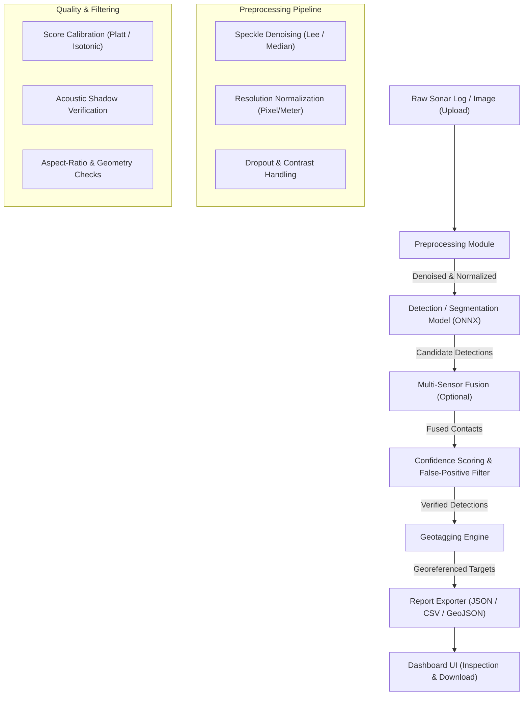

# Architecture Document

**Project:** MarineGuard — Automated Underwater Marine Debris Detection  
**Context:** MoES SIH26057 Operational Pipeline  

---

## 1. High-Level Data Flow

The operational pipeline ingests raw side-scan sonar (SSS) imagery and navigation logs, processes them through acoustic filtering and neural inference, suppresses false positives, attaches geographic coordinates, and produces actionable survey reports.

---

## 2. Module Inventory

| Module | Responsibility | Current Codebase Status | SIH26057 Scope Action |
|:---|:---|:---|:---|
| **Preprocessing** | Denoise (speckle filter), resolution normalization, contrast enhancement, dropout simulation. | Planned (Phase 1) | Implement standalone pipeline using OpenCV / NumPy. |
| **Detection / Segmentation** | Trained model inference (YOLOv8-seg / U-Net) to detect debris classes. | Partially Implemented (`side_scan.py` uses 1D CA-CFAR heuristic) | Swap CFAR with trained ONNX model in Phase 2. |
| **Multi-Sensor Fusion** | Confidence-weighted combination when auxiliary sensors (optical/bathymetry) exist. | Implemented (`marineguard/detection/fusion.py`) | Retain as accuracy booster when multi-modal data is available. |
| **Confidence & Filtering** | Confidence recalibration (0–100%) and suppression of rock/shadow false hits. | Partially Implemented (Basic threshold in `side_scan.py`) | Implement shadow-ratio and aspect-ratio filter logic in Phase 2. |
| **Geotagging** | Ping headers/metadata $\to$ latitude/longitude calculation using vehicle trajectory. | Partially Implemented (Hardcoded mock coordinates in harness) | Implement ping-header coordinate translation engine in Phase 3. |
| **Report Exporter** | Generation of standardized JSON and CSV reports conforming to Phase 0 schema. | Partially Implemented (`geojson_export.py`, `pdf_report.py`) | Implement dedicated `json_csv_report.py`; keep GeoJSON as bonus format. |
| **Dashboard UI** | Web interface for file upload, overlay display, GIS map, metrics, and downloads. | Implemented (`streamlit_demo.py` uses telemetry sliders & replay) | Rework to upload $\to$ process $\to$ inspect $\to$ export workflow. |
| **Sensor Compiler** | Parses platform YAML specs into sensor configurations and tool stubs. | Implemented (`marineguard/compiler/`) | Frozen; pitch-aside only per `rules.md §5`. |
| **Mission Firewall** | Safety gating for vehicle actions based on battery and acoustic link. | Implemented (`marineguard/firewall/`) | Deprecated from core critical path; no vehicle control in PS. |

---

## 3. Technology Stack

* **Inference Runtime:** PyTorch $\to$ ONNX Runtime (optimized for edge execution on NVIDIA Jetson AGX Xavier / Orin).
* **Signal & Image Processing:** OpenCV, NumPy, SciPy, Pillow, scikit-image.
* **Backend & Validation:** Python 3.10+, Pydantic V2 (`marineguard/schemas.py`), PyYAML.
* **Dashboard / Visualization:** Streamlit, Plotly, Matplotlib (evidence visualizer).
* **Data Sources (Public Sonar Datasets):** Marine Debris FLS, UATD (Underwater Acoustic Target Dataset), SeaClear, TrashCan.
* **Export Formats:** JSON, CSV (built-in stdlib / Pandas), GeoJSON (`geojson_export.py`).

---

## 4. Data Contracts (`marineguard/schemas.py`)

The data contracts define standardized interfaces between the detection pipeline and downstream consumers:

### Primary Core Models
* **`PlatformSpec` / `SensorSpec`:** Defines platform physical configuration and sensor characteristics (frequency, swath, resolution). Kept frozen.
* **`DebrisContact`:** Raw contact generated by a single sensor pass:
  * `contact_id`: Unique identifier
  * `sensor_type`: Sonar, optical, or bathymetry
  * `raw_confidence`: Float $[0.0, 1.0]$
  * `bbox`: Bounding box coordinates
  * `acoustic_shadow_ratio`: Ratio of shadow length to highlight
  * `estimated_dimensions_m`: $(L, W, H)$ in meters
  * `lat_lon`: Estimated geographical coordinate
* **`ClassifiedTarget`:** Consolidated target after fusion and filtering:
  * `target_id`: Target identifier
  * `species`: Debris classification (`ghost_net`, `plastic_container`, `metal_debris`, `munition`, `unknown`)
  * `confidence`: Calibrated confidence score $[0.0, 1.0]$
  * `sensor_contributions`: Dictionary of per-sensor contributions
  * `geometry_m`: Refined dimensions in meters
  * `lat_lon`: Calibrated latitude and longitude
  * `removal_priority`: Priority tier (`HIGH`, `MEDIUM`, `LOW`)
* **`TraceEvent`:** Audit log capturing reasoning steps, model confidence, and overlay paths.
* **`SurveyJob`:** Execution metadata representing a single survey run.

### Deprecated from Schema (`rules.md §1 & §5`)
* `FirewallDecision`, `Action`, `MissionContext`, and battery/comms reserve fields are slated for removal from the primary survey flow as they pertain to autonomous vehicle actuation.

---

## 5. Architectural Scoping Decisions (What Was Removed and Why)

| Dropped Component | Architectural Rationale |
|:---|:---|
| **MCP Natural-Language Agent Interface** | Not part of SIH26057. Adds agent reasoning latency and unpredictable interaction without scoring value in a computer vision competition. |
| **Mission Firewall (Safety Gating)** | The problem statement asks for debris detection and reporting from sonar imagery, not autonomous AUV vehicle control or thruster override. |
| **Live Platform Hot-Swap Dashboard** | Dynamic platform switching adds UI complexity; static YAML spec loading is sufficient for demonstration. |
| **IHO S-100 Hydrographic Export** | Specialized maritime standard out of scope for debris removal operations; standard GeoJSON and CSV provide superior GIS interoperability. |
| **Simulated Telemetry Sliders** | Telemetry sliders (battery %, comms kbps) distract from the core upload $\to$ detect $\to$ report user flow. |

---

## 6. Deployment Notes

* **Edge Compute Target:** The inference pipeline is architected for deployment on embedded edge systems (e.g. NVIDIA Jetson AGX Xavier / Orin). Models are exported to ONNX to eliminate heavy cloud or framework dependencies.
* **Latency Budget:** Total per-ping processing budget is targeted at $\le 200\text{ ms}$, ensuring the pipeline operates at real-time survey speeds ($2.0\text{--}2.3\text{ km}^2/\text{hr}$).
* **Standalone UI:** The Streamlit dashboard runs locally or as a lightweight container without external database or cloud requirements, enabling offline operation aboard survey vessels.
